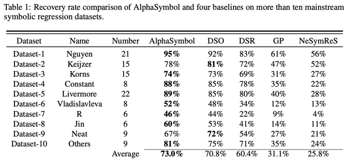
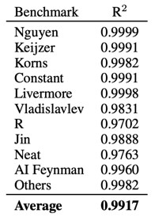
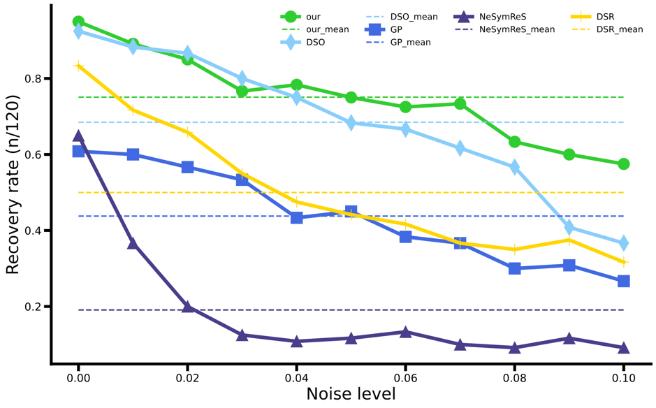

# Discovering mathematical formulas from data via LSTM-guided Monte Carlo Tree Search

This repository is the official implementation of [My Paper Title](https://arxiv.org/abs/2030.12345). 

>📋  Optional: include a graphic explaining your approach/main result, bibtex entry, link to demos, blog posts and tutorials

## Requirements

1,Create a Python 3.7 virtual environment
```setup
conda create -n venv python=3.7 # Create a Python 3.7 virtual environment
```
2,To activate the newly created environment, use the following command:
```setup
source activate venv  # activate the newly created environment
```
3,To install requirements:
```setup
pip install -r requirements.txt # To install all the required dependencies. 
```

>📋  Describe how to set up the environment, e.g. pip/conda/docker commands, download datasets, etc...

## Training

Setting the appropriate parameters in the main.py file
```train
results = train(
        X_constants,
        y_constants,
        X_rnn,
        y_rnn,
        # operator_list = S,
        operator_list = ['*','+','-','/','sin','cos','var_x1'],
        min_length = 2,
        max_length = 60,
        type = 'lstm',
        num_layers = 2,
        hidden_size = 250,
        dropout = 0.0,
        lr = 0.0005,
        optimizer = 'adam',
        inner_optimizer = 'lbfgs',
        inner_lr = 0.1,
        inner_num_epochs = 10,
        entropy_coefficient = 0.005,
        risk_factor = 0.95,
        initial_batch_size = 1000,
        scale_initial_risk = True,
        batch_size = 1000,
        num_batches = 10000,
        use_gpu = False,
        live_print = True,
        summary_print = True,
        config_prior='./config_prior.json'
    )
```
In the config_prior.py file, select the restrictions to apply during the search (true or false).
(Note that the maximum and minimum length restrictions in config_prior.py are the same as those in main.py.)

Getting started
```train
python main.py 
```

>📋  Describe how to train the models, with example commands on how to train the models in your paper, including the full training procedure and appropriate hyperparameters. 
> 在main.py文件里面指定算法的各种参数，然后指定对应的X和Y，
## Evaluation

  We evaluated the performance of AlphaSymbol on more than ten classic datasets in the field of symbolic regression. These datasets are labeled Nguyen, Keijzer, Korns, Constant, Livermore, R, Vladislavlev, Jin, Neat, AI Feynman, and Others. The datasets mentioned above collectively contain a total of 222 test expressions.
We compare AlphaSymbol with four symbol regression algorithms that have demonstrated high performance:

**DSO**. A superior algorithm that effectively integrates reinforcement learning and genetic programming (GP) for symbolic regression tasks. 

**DSR**. An exceptional algorithm that effectively employs deep reinforcement learning in the domain of symbolic regression.

**GP**. A classic algorithm that applies genetic algorithms perfectly to the field of symbolic regression. Greatly improved search efficiency.

**NeSymReS**. This algorithm is categorized as a large-scale pre-training model.

The Pythagorean theorem is $a^2 + b^2 = c^2.$

[//]: # (```eval)

[//]: # (python eval.py --model-file mymodel.pth --benchmark imagenet)

[//]: # (```)
## Pre-trained Models

You can download pretrained models here:

- [My awesome model](https://drive.google.com/mymodel.pth) trained on ImageNet using parameters x,y,z. 

## Results
### [Image Classification on ImageNet](https://paperswithcode.com/sota/image-classification-on-imagenet)

[//]: # (| Model name         | Top 1 Accuracy  | Top 5 Accuracy |)

[//]: # (| ------------------ |---------------- | -------------- |)

[//]: # (| My awesome model   |     85%         |      95%       |)

Recovery rate comparison of AlphaSymbol and four baselines on more than ten mainstream symbolic regression datasets.




Average Coefficient of Determination (R^2) on Various Datasets




Figure describes the recovery rate of AlphaSymbol and four other excellent algorithms on all Nguyen benchmarks under different levels of noise.

[//]: # (![Sample results plot]&#40;noise.png&#41;)



## Contributing

>📋  Pick a licence and describe how to contribute to your code repository. 