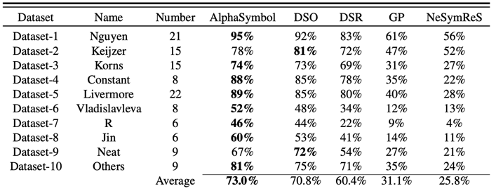

# Discovering mathematical formulas from data via LSTM-guided Monte Carlo Tree Search

This repository is the official implementation of [My Paper Title](https://arxiv.org/abs/2030.12345). 

>📋  Optional: include a graphic explaining your approach/main result, bibtex entry, link to demos, blog posts and tutorials

## Requirements

1,Create a Python 3.7 virtual environment
```setup
conda create -n venv python=3.7 # Create a Python 3.7 virtual environment
```
2,To activate the newly created environment, use the following command:
```setup
source activate venv  # activate the newly created environment
```
3,To install requirements:
```setup
pip install -r requirements.txt # To install all the required dependencies. 
```

>📋  Describe how to set up the environment, e.g. pip/conda/docker commands, download datasets, etc...

## Training

Setting the appropriate parameters in the main.py file
```train
results = train(
        X_constants,
        y_constants,
        X_rnn,
        y_rnn,
        # operator_list = S,
        operator_list = ['*','+','-','/','sin','cos','var_x1'],
        min_length = 2,
        max_length = 60,
        type = 'lstm',
        num_layers = 2,
        hidden_size = 250,
        dropout = 0.0,
        lr = 0.0005,
        optimizer = 'adam',
        inner_optimizer = 'lbfgs',
        inner_lr = 0.1,
        inner_num_epochs = 10,
        entropy_coefficient = 0.005,
        risk_factor = 0.95,
        initial_batch_size = 1000,
        scale_initial_risk = True,
        batch_size = 1000,
        num_batches = 10000,
        use_gpu = False,
        live_print = True,
        summary_print = True,
        config_prior='./config_prior.json'
    )
```
Getting started
```train
python main.py 
```

>📋  Describe how to train the models, with example commands on how to train the models in your paper, including the full training procedure and appropriate hyperparameters. 
> 在main.py文件里面指定算法的各种参数，然后指定对应的X和Y，
## Evaluation

To evaluate my model on ImageNet, run:

```eval
python eval.py --model-file mymodel.pth --benchmark imagenet
```

>📋  Describe how to evaluate the trained models on benchmarks reported in the paper, give commands that produce the results (section below).

## Pre-trained Models

You can download pretrained models here:

- [My awesome model](https://drive.google.com/mymodel.pth) trained on ImageNet using parameters x,y,z. 

>📋  Give a link to where/how the pretrained models can be downloaded and how they were trained (if applicable).  Alternatively you can have an additional column in your results table with a link to the models.

## Results

Our model achieves the following performance on :

### [Image Classification on ImageNet](https://paperswithcode.com/sota/image-classification-on-imagenet)

[//]: # (| Model name         | Top 1 Accuracy  | Top 5 Accuracy |)

[//]: # (| ------------------ |---------------- | -------------- |)

[//]: # (| My awesome model   |     85%         |      95%       |)


>📋  Include a table of results from your paper, and link back to the leaderboard for clarity and context. If your main result is a figure, include that figure and link to the command or notebook to reproduce it. 


## Contributing

>📋  Pick a licence and describe how to contribute to your code repository. 